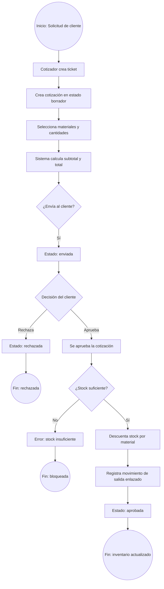

# Diagrama BPMN — Proceso de Cotización e Integración con Inventario

```mermaid
flowchart TD
    Start((Inicio: Solicitud de cliente)) --> A[Cotizador crea ticket]
    A --> B[Crea cotización en estado borrador]
    B --> C[Selecciona materiales y cantidades]
    C --> D[Sistema calcula subtotal y total]
    D --> E{¿Envía al cliente?}
    E -- Sí --> F[Estado: enviada]
    F --> G{Decisión del cliente}
    G -- Aprueba --> H[Se aprueba la cotización]
    G -- Rechaza --> I[Estado: rechazada]
    I --> End1((Fin: rechazada))

    H --> J{¿Stock suficiente?}
    J -- No --> K[Error: stock insuficiente]
    K --> End2((Fin: bloqueada))
    J -- Sí --> L[Descuenta stock por material]
    L --> M[Registra movimiento de salida enlazado]
    M --> N[Estado: aprobada]
    N --> End3((Fin: inventario actualizado))
```
