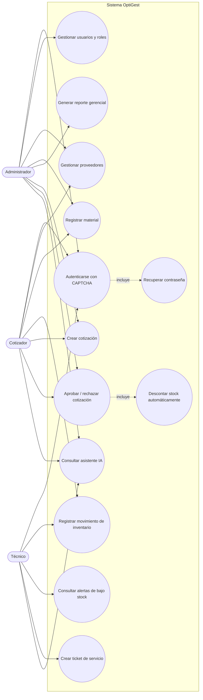

# Diagrama de Casos de Uso — OptiGest

```mermaid
flowchart LR
    Admin([Administrador])
    Tecnico([Técnico])
    Cotizador([Cotizador])

    subgraph Sistema OptiGest
        UC0((Autenticarse con CAPTCHA))
        UC0b((Recuperar contraseña))
        UC1((Gestionar usuarios y roles))
        UC2((Gestionar proveedores))
        UC3((Registrar material))
        UC4((Registrar movimiento de inventario))
        UC5((Consultar alertas de bajo stock))
        UC6((Generar reporte gerencial))
        UC7((Crear ticket de servicio))
        UC9((Crear cotización))
        UC10((Aprobar / rechazar cotización))
        UC11((Descontar stock automáticamente))
        UC12((Consultar asistente IA))
    end

    Admin --> UC0
    Tecnico --> UC0
    Cotizador --> UC0
    UC0 -.incluye.-> UC0b

    Admin --> UC1
    Admin --> UC2
    Admin --> UC3
    Admin --> UC6
    Admin --> UC9
    Admin --> UC10

    Cotizador --> UC2
    Cotizador --> UC3
    Cotizador --> UC4
    Cotizador --> UC9
    Cotizador --> UC10

    Tecnico --> UC4
    Tecnico --> UC5
    Tecnico --> UC7

    Admin --> UC12
    Cotizador --> UC12
    Tecnico --> UC12

    UC10 -.incluye.-> UC11
```
