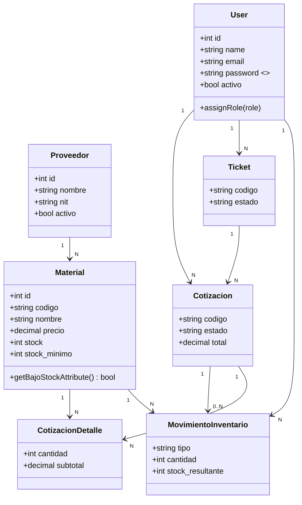

# Diagrama de Clases del Dominio — OptiGest

```mermaid
classDiagram
    class User {
        +int id
        +string name
        +string email
        +string password  <<bcrypt hash>>
        +bool activo
        +assignRole(role)
    }

    class Proveedor {
        +int id
        +string nombre
        +string nit
        +bool activo
    }

    class Material {
        +int id
        +string codigo
        +string nombre
        +decimal precio
        +int stock
        +int stock_minimo
        +getBajoStockAttribute() bool
    }

    class MovimientoInventario {
        +string tipo
        +int cantidad
        +int stock_resultante
    }

    class Ticket {
        +string codigo
        +string estado
    }

    class Cotizacion {
        +string codigo
        +string estado
        +decimal total
    }

    class CotizacionDetalle {
        +int cantidad
        +decimal subtotal
    }

    Proveedor "1" --> "N" Material
    Material "1" --> "N" MovimientoInventario
    User "1" --> "N" MovimientoInventario
    User "1" --> "N" Ticket
    User "1" --> "N" Cotizacion
    Ticket "1" --> "N" Cotizacion
    Cotizacion "1" --> "N" CotizacionDetalle
    Material "1" --> "N" CotizacionDetalle
    Cotizacion "1" --> "0..N" MovimientoInventario
```
